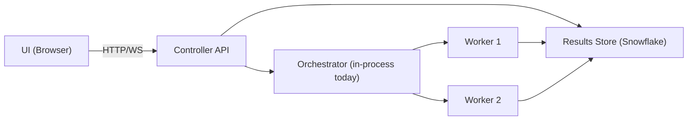

# Architecture Overview (Current)

Last updated: 2026-02-08

## System Purpose

FlakeBench is a FastAPI app that benchmarks existing Snowflake and
Postgres-family tables. It runs controlled workloads, captures app-side latency
and throughput, and persists results to Snowflake.

## Runtime Topology

- **Controller**: single FastAPI process (`backend/main.py`) serving UI, API, and
  WebSocket streaming.
- **Execution paths**:
  - **AUTO/BOUNDED scaling**: Orchestrator-backed, multi-worker capable
    (`backend/core/orchestrator.py` + `scripts/run_worker.py`).
  - **FIXED scaling**: legacy in-memory registry + executor path
    (`backend/core/test_registry.py`, `backend/core/test_executor.py`).
- **WebSocket**: `/ws/test/{test_id}` streams live metrics from the in-memory cache.
- **Live metrics cache**: populated by workers via `/api/runs/{run_id}/metrics/live`.
- **Results store**: Snowflake (`FLAKEBENCH.TEST_RESULTS`).
- **Postgres**: optional target for Postgres-family benchmarks.

## Connection Architecture

FlakeBench uses two types of database connections:

### Control Plane Connections (Environment-Based)
- **Source**: `settings.SNOWFLAKE_*` from `.env`
- **Purpose**: Results storage, orchestrator state, telemetry
- **Pool**: `snowflake_pool.get_default_pool()` in `orchestrator.py`
- **Note**: Always uses environment credentials

### Benchmark Execution Connections (Stored or Environment)
- **Source**: Either stored connection (`CONNECTIONS` table) or `.env` fallback
- **Purpose**: Running benchmark queries against target databases
- **Pool**: Per-test pools created in `scripts/run_worker.py`
- **Selection**: Via `connection_id` in template CONFIG (optional)

### Connection Storage (`backend/core/connection_manager.py`)
- Credentials encrypted with AES-256-GCM via Snowflake's `ENCRYPT_RAW`
- Key from `FLAKEBENCH_CREDENTIAL_KEY` env var (32 bytes)
- Stored in `CONNECTIONS` table as encrypted VARIANT
- `get_connection_for_pool()` retrieves decrypted credentials for workers

### Connection Model (Simplified)
Connections store only authentication info:
- `connection_type`: SNOWFLAKE or POSTGRES
- `account`: Snowflake account identifier
- `host`/`port`: Postgres host and port
- `role`: Snowflake role
- `credentials`: Encrypted username/password/private_key

Database, schema, warehouse, and pool sizes are all configured per-template, not per-connection.

## High-Level Components

- **UI**: Jinja2 + Alpine.js + Chart.js in `backend/templates/` and
  `backend/static/`.
- **Orchestrator (multi-worker)**: `backend/core/orchestrator.py` for control
  plane state and worker lifecycle.
- **Legacy registry/executor (fixed runs)**: `backend/core/test_registry.py`,
  `backend/core/test_executor.py`.
- **Metrics collector**: `backend/core/metrics_collector.py` aggregates app-level
  metrics before persistence and streaming.
- **Persistence**: `backend/core/results_store.py`.
- **Table managers**: `backend/core/table_managers/*` for Standard/Hybrid/
  Interactive/Postgres table types (no DDL at runtime).
- **Connectors**: `backend/connectors/snowflake_pool.py`,
  `backend/connectors/postgres_pool.py`.
- **Templates**: stored in `FLAKEBENCH.TEST_RESULTS.TEST_TEMPLATES`.

### Helper Packages (Modular Structure)

Large modules have associated helper packages to reduce file sizes and improve
maintainability. The original files remain the primary entry points with
backward-compatible imports:

| Main Module | Helper Package | Contents |
|-------------|----------------|----------|
| `backend/core/test_executor.py` | `backend/core/executor/` | Types, helpers, mixins (metrics, workers, operations, controllers) |
| `backend/core/orchestrator.py` | `backend/core/orchestrator_helpers/` | RunContext dataclass, utility functions |
| `backend/api/routes/test_results.py` | `backend/api/routes/results_helpers/` | Helper functions for data aggregation |
| `backend/api/routes/templates.py` | `backend/api/routes/templates_helpers/` | Constants and helper functions |

## Control Plane vs Data Plane (Multi-Worker)

### Control Plane (Orchestrator)
- Creates parent runs and assigns worker groups.
- Starts/stops workers and manages retries.
- Updates authoritative run status and timing in Snowflake.
- Aggregates metrics from worker snapshots into parent rollups.

### Data Plane (Workers)
- Executes workload queries against target systems.
- Emits live metrics snapshots to `WORKER_METRICS_SNAPSHOTS` and logs.
- Pushes 1s live metrics to the controller cache (`/api/runs/{run_id}/metrics/live`).
- Persists query executions and per-worker snapshots.
- Workers joining after warmup ends start directly in MEASUREMENT phase.

## Runtime Topology (Local + SPCS)

### Local
- Controller runs as a FastAPI process.
- Orchestrator runs as an **embedded async task** within the controller process.
- Workers run as subprocesses spawned by the orchestrator.
- Orchestrator retains subprocess handles for SIGTERM fallback on stop.

### SPCS (Future)
- Controller runs as a long-running SPCS service.
- Orchestrator runs as a separate service (or job controller).
- Workers run as job services or short-lived services per run.

## Control Tables (Hybrid Tables)

> **Requirement**: Hybrid Tables require **Snowflake Enterprise Edition** or higher.
> They are available in AWS and Azure commercial regions only (not GCP or SnowGov).
> Trial accounts do not support Hybrid Tables.

The control-plane state tables use **Snowflake Hybrid Tables** for:

- **Row-level locking**: Concurrent worker heartbeats and orchestrator updates
  do not block each other.
- **ACID transactions**: Phase transitions and stop signals are atomic.
- **Enforced primary keys**: `RUN_ID` uniqueness guaranteed by the database.

Tables:
- `RUN_STATUS`: Per-parent-run lifecycle state (status, phase, timing, worker counts)
- `RUN_CONTROL_EVENTS`: Append-only control messages (STOP, START, SET_PHASE, SET_WORKER_TARGET)
- `WORKER_HEARTBEATS`: Worker liveness and status for control-plane decisions

See `data-flow-and-lifecycle.md` for schema details.

## Constraints and Non-Goals

- No DDL is executed at runtime; schema changes live in `sql/schema/`.
- No migration framework exists in this repository.
- No desktop packaging or container/cloud deployment automation in this codebase.
- YAML templates in `config/test_scenarios/` are reference-only for the UI.
- All runs are template-based; templates live in Snowflake.
